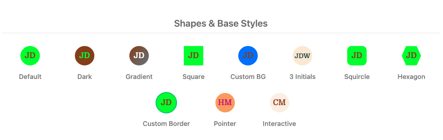
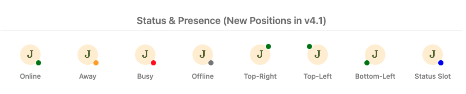
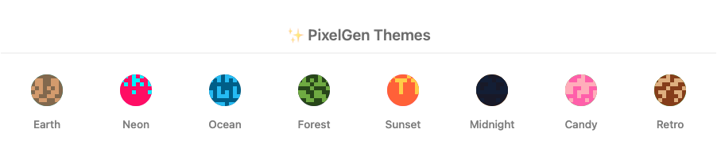
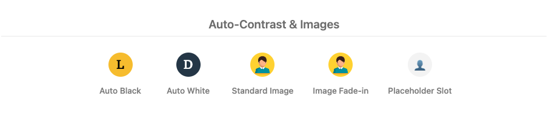
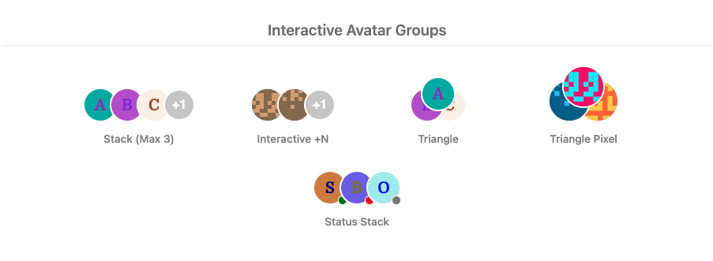

# vue3-avatar

> A lightweight, customizable, and accessible avatar component for Vue 3 and Nuxt.

**📖 [Read the Documentation & Try the Interactive Playground](https://vue3-avatar.vercel.app/)**

**🆕 v5 is out** — a real tooltip engine, badges, image fallback chains, `as`/`disabled`/`selected`/`editable`, and a TypeScript source.
[What's new](https://vue3-avatar.vercel.app/whats-new) · [Migrating from v4](https://vue3-avatar.vercel.app/migration/v4-to-v5)

[](https://www.npmjs.com/package/vue3-avatar)
[](https://www.npmjs.com/package/vue3-avatar)
[](https://bundlephobia.com/package/vue3-avatar)
[](https://github.com/absurdengineer/vue3-avatar/blob/master/LICENSE)
[](https://vue3-avatar.vercel.app/)

**Avatar Vue** is a feature-rich component for displaying user profiles, team members, or entity icons. It supports **initials-based avatars**, **custom images** with lazy loading, **deterministic pixel art (identicons)**, and **avatar groups** with overflow handling.

Whether you need a simple profile picture or a complex team display, **Avatar Vue** handles fallback logic, accessibility, and responsiveness out of the box.

## Why vue3-avatar?

Most UI libraries include an avatar, but only as a primitive — a circle, maybe an image.
`vue3-avatar` is the choice when you need more without adding a full design system:

| Feature                  | vue3-avatar         | Vuetify `v-avatar` | PrimeVue `Avatar` |
| ------------------------ | ------------------- | ------------------ | ----------------- |
| Initials (multi-word)    | ✅ Smart extraction | ✅                 | ✅                |
| Pixel art / identicons   | ✅ 8 themes         | ❌                 | ❌                |
| Avatar groups + overflow | ✅                  | ❌                 | ❌                |
| Auto-contrast text       | ✅                  | ❌                 | ❌                |
| Status badges            | ✅ 4 positions      | ❌                 | ✅                |
| SSR / Nuxt safe          | ✅                  | ✅                 | ✅                |
| Zero dependencies        | ✅                  | ❌ (full lib)      | ❌ (full lib)     |
| Custom image slot        | ✅ (NuxtImg ready)  | ❌                 | ❌                |

Works with Tailwind CSS, UnoCSS, Headless UI, or any setup that doesn't include a UI library. Drop it in and it handles the rest.

## Key Features

- ⚡ **Lightweight & Fast**: Optimized for Vue 3.
- 🎨 **Smart Initials**: Automatically extracts initials from names (e.g., "Tony Stark" → "TS").
- 🖼️ **Image Support**: Seamlessly handles image URLs with automatic fallback to initials or pixel art on error.
- 👾 **PixelGen**: Generates consistent, deterministic pixel art (identicons) like GitHub/Gravatar.
- 👥 **Avatar Groups**: Easily stack avatars for teams with `+N` overflow badges.
- 🌗 **Auto-Contrast**: Automatically adjusts text color (black/white) based on background luminance.
- ♿ **Accessible**: Built with a11y in mind (ARIA roles, keyboard support).
- 🟢 **Status Indicators**: Built-in presence dots with custom statuses, sizes, colours, and an optional pulse.
- 💬 **Built-in Tooltips**: Styled, collision-aware tooltips with twelve placements — no Popper or Floating UI dependency.
- 🔴 **Notification Badges**: Counts, dots, and custom badge content in any corner.
- 🛡️ **Resilient Images**: Ordered fallback chains, a loading skeleton, and retina `srcset` support.
- ☁️ **SSR & Nuxt Ready**: Safe for server-side rendering with no hydration mismatches.

## Examples

- **Tony** will become **T**
- **Tony Stark** will become **TS**
- **Tony Howard-Stark** will become **THS**
- **Albert Tony Howard Stark** will become **ATS**

## Previews

### Shapes & Base Styles



### Status & Presence



### PixelGen Themes



### Auto-Contrast & Images



### Interactive Avatar Groups



## Installation

```bash
npm install vue3-avatar
```

## Usage

**Avatar Vue** is very easy to use.

### ES6

**For Local Registration**

```javascript
import { Avatar, AvatarGroup } from "vue3-avatar";

export default {
  // ...
  components: {
    Avatar,
    AvatarGroup, // Optional: if you want to use grouping
    // ...
  },
  // ...
};
```

**For Global Registration (with optional defaults)**

Update main.js

```javascript
import { createApp } from "vue";
import App from "./App.vue";
import Avatar from "vue3-avatar";

const app = createApp(App);

// Configure global defaults (Optional)
app.use(Avatar, {
  defaults: {
    size: 50,
    autoContrast: true,
    transition: true,
    loading: "lazy",
    shape: "circle",
  },
});
```

After importing the component, use it in your template:

```html
<Avatar name="John Doe" />
```

## Nuxt.js Support

**Avatar Vue** is fully SSR-safe and optimized for Nuxt.js 3+, and ships an official Nuxt module.

### 1. Installation in Nuxt (recommended: Nuxt module)

Add `vue3-avatar/nuxt` to your `modules` array — `<Avatar>` and `<AvatarGroup>` are then auto-imported, no manual plugin registration needed:

```typescript
// nuxt.config.ts
export default defineNuxtConfig({
  modules: ["vue3-avatar/nuxt"],
  vue3Avatar: {
    defaults: {
      size: 40,
      autoContrast: true,
    },
  },
});
```

```html
<template>
  <Avatar name="John Doe" />
</template>
```

See the full [Nuxt module guide](https://vue3-avatar.vercel.app/guide/nuxt-module) for all module options.

#### Manual plugin registration (fallback)

If you'd rather register the plugin yourself — or are using Vue 3 without Nuxt — create a plugin file `plugins/avatar.ts`:

```typescript
import { defineNuxtPlugin } from "#app";
import Avatar from "vue3-avatar";

export default defineNuxtPlugin((nuxtApp) => {
  nuxtApp.vueApp.use(Avatar, {
    defaults: {
      size: 40,
      autoContrast: true,
    },
  });
});
```

### 2. Standard Scoped Slot for NuxtImg

Use the `#image` slot to integrate with custom image components like `<NuxtImg>` for better performance and automatic optimization.

```html
<template>
  <Avatar name="John Doe" image-src="/profile.jpg">
    <template #image="{ src, alt, size, style }">
      <NuxtImg
        :src="src"
        :alt="alt"
        :width="size"
        :height="size"
        :style="style"
        loading="lazy"
      />
    </template>
  </Avatar>
</template>
```

### 3. SSR-Safe Deterministic Colors

Colors and Pixel patterns are generated deterministically based on the `name` prop, ensuring no hydration mismatches between server-side rendering and client-side activation.

## Props

| Property                                  | Type               | Default          | Description                                                                     |
| ----------------------------------------- | ------------------ | ---------------- | ------------------------------------------------------------------------------- |
| `name`                                    | String             | required         | Name used for initials, generated colours, pixel art, and the accessible label. |
| `imageSrc`                                | String             | —                | Image URL. Use `image-src` in templates.                                        |
| `size`                                    | Number             | `40`             | Avatar diameter in pixels.                                                      |
| `inline`                                  | Boolean            | `false`          | Displays the avatar inline.                                                     |
| `shape`                                   | String             | derived          | `circle`, `square`, `squircle`, or `hexagon`. Overrides `rounded`.              |
| `rounded`                                 | Boolean            | `true`           | Uses a circle when true or a square when false, if `shape` is omitted.          |
| `variant`                                 | String             | `initials`       | `initials` or `pixel`.                                                          |
| `pixelTheme`                              | String             | `earth`          | `earth`, `neon`, `ocean`, `forest`, `sunset`, `midnight`, `candy`, or `retro`.  |
| `color` / `background`                    | String             | generated        | Override the foreground or background colour.                                   |
| `dark` / `gradient`                       | Boolean            | `false`          | Use the dark palette or a name-based gradient.                                  |
| `autoContrast`                            | Boolean            | `false`          | Choose black or white text for a hexadecimal background colour.                 |
| `border` / `borderColor`                  | Boolean / String   | `true` / `white` | Control the native image border; initials and pixel avatars keep their outline. |
| `alt`                                     | String             | derived          | Accessible label; defaults to `Avatar of {name}`.                               |
| `loading` / `transition`                  | String / Boolean   | `lazy` / `true`  | Native image loading and image fade-in behaviour.                               |
| `interactive`                             | Boolean            | `false`          | Enables keyboard activation and emits `activate`.                               |
| `pointer` / `onClick`                     | Boolean / Function | `false` / —      | Shows a pointer cursor; `onClick` also receives activation events.              |
| `customAvatarStyle` / `customStatusStyle` | Object             | `{}`             | Inline style overrides.                                                         |
| `sameBorder` / `useTextColorForBorder`    | Boolean            | `false`          | Status-border and avatar-border colour options.                                 |
| `useLegacyColors`                         | Boolean            | `false`          | Uses the legacy `vue-avatar` palette.                                           |

### Tooltip props

Full reference in the [tooltip documentation](https://vue3-avatar.absurdengineer.com/components/tooltip).

| Property             | Type                      | Default        | Description                                                                                     |
| -------------------- | ------------------------- | -------------- | ----------------------------------------------------------------------------------------------- |
| `tooltip`            | String / Boolean / Object | —              | Content. Unset uses `name`; `false` disables it; an object supplies inline overrides.           |
| `tooltipPlacement`   | String                    | `top`          | `top`, `bottom`, `left`, `right`, each optionally suffixed `-start` or `-end`.                  |
| `tooltipTrigger`     | String                    | `hover focus`  | Space-separated combination of `hover`, `focus`, `click`, `manual`.                             |
| `tooltipDelay` / `tooltipHideDelay` | Number     | `200` / `100`  | Open and close delays in milliseconds.                                                          |
| `tooltipOffset`      | Number                    | `8`            | Gap between the avatar and the tooltip.                                                         |
| `tooltipArrow`       | Boolean                   | `true`         | Shows the arrow.                                                                                |
| `tooltipTheme`       | String                    | `dark`         | `dark`, `light`, or `auto` (follows `prefers-color-scheme`).                                    |
| `tooltipInteractive` | Boolean                   | `false`        | Keeps the tooltip open while the pointer is inside it.                                          |
| `tooltipDisabled`    | Boolean                   | `false`        | Runtime kill switch, separate from `tooltip: false`.                                            |
| `nativeTitle`        | Boolean                   | `false`        | Restores the v4 `title` attribute and disables the styled tooltip.                              |

### Status props

| Property         | Type                     | Default        | Description                                                                                  |
| ---------------- | ------------------------ | -------------- | -------------------------------------------------------------------------------------------- |
| `status`         | String                   | —              | `online`, `away`, `offline`, `busy`, or any key present in `statusColors`.                    |
| `statusPosition` | String                   | `bottom-right` | `top-right`, `top-left`, `bottom-right`, or `bottom-left`.                                   |
| `statusColor`    | String                   | —              | Overrides the colour for this avatar, whatever the status is.                                |
| `statusColors`   | Object                   | `{}`           | Extra or replacement colours, merged over the built-in four. Also accepted in the global config. |
| `statusSize`     | String / Number          | `md`           | `sm`, `md`, `lg`, or explicit pixels.                                                        |
| `statusLabel`    | String                   | —              | Replaces "User is {status}" in the accessible label.                                         |
| `statusPulse`    | Boolean                  | `false`        | Animates a pulsing ring. Suppressed under `prefers-reduced-motion`.                          |
| `sameBorder`     | Boolean                  | `false`        | Makes the status indicator use the avatar border colour.                                     |

### Badge props

| Property                          | Type            | Default             | Description                                                                          |
| --------------------------------- | --------------- | ------------------- | ------------------------------------------------------------------------------------ |
| `badge`                           | String / Number | —                   | Badge content. Renders the badge when set.                                           |
| `badgeVariant`                    | String          | `count`             | `count`, `dot`, or `icon`. `dot` needs no `badge` value.                             |
| `badgeMax`                        | Number          | `999`               | Counts above this render as `{max}+`. Digit strings are clamped like numbers.        |
| `badgeMaxLength`                  | Number          | `3`                 | Letters kept in a non-numeric badge. `"Promotional"` renders as `"Pro"`.             |
| `badgePosition`                   | String          | `top-right`         | Same four corners as `statusPosition`.                                               |
| `badgeColor` / `badgeTextColor`   | String          | `#ef4444` / derived | Given only a hexadecimal background, the text colour is chosen for contrast.         |
| `badgeLabel`                      | String          | derived             | Wording for the badge in the accessible label.                                       |
| `customBadgeStyle`                | Object          | `{}`                | Inline style overrides for the badge, including `maxWidth` to allow a wider label.    |

Badge content is capped so a corner marker stays one: counts above `badgeMax`
render as `999+`, and other content is trimmed to `badgeMaxLength` letters — the
same three-character budget the initials use. The badge is also capped at the
avatar's own width, so a long label cannot run across the face.

### Image props

| Property           | Type              | Default | Description                                                                                       |
| ------------------ | ----------------- | ------- | ------------------------------------------------------------------------------------------------- |
| `fallbackSrc`      | String / String[] | —       | Sources tried in order when `imageSrc` fails, before falling back to initials or pixel art.       |
| `skeleton`         | Boolean           | `true`  | Shimmer placeholder while the image loads. Rendered only after mount, so SSR output stays stable. |
| `retina`           | Boolean           | `false` | Derives an `@2x` `srcset` from `imageSrc` when no explicit `srcset` is set.                        |
| `srcset` / `sizes` | String            | —       | Passed through to the ``. An explicit `srcset` wins over `retina`.                            |
| `crossorigin`      | String            | —       | `anonymous` or `use-credentials`.                                                                  |
| `referrerpolicy`   | String            | —       | Passed through to the ``.                                                                     |
| `decoding`         | String            | `async` | `async`, `sync`, or `auto`.                                                                        |

### Interaction props

| Property                   | Type    | Default            | Description                                                                                    |
| -------------------------- | ------- | ------------------ | ----------------------------------------------------------------------------------------------- |
| `as`                       | String  | `div`              | `div`, `button`, or `a`. Native elements bring real semantics and keyboard handling.            |
| `href` / `target` / `rel`  | String  | —                  | Used when `as="a"`. `target="_blank"` adds `rel="noopener noreferrer"` unless `rel` is set.     |
| `disabled`                 | Boolean | `false`            | Blocks activation, dims the avatar, and sets `aria-disabled` or the native `disabled`.          |
| `selected`                 | Boolean | —                  | Opt-in toggle state, rendered as `aria-pressed`. Leave unset for avatars that are not toggles.  |
| `editable`                 | Boolean | `false`            | Adds an overlay for changing the picture. Emits `edit`. Decorative on `button`/`a` roots.       |
| `accept`                   | String  | —                  | With `editable`, wires a hidden file input and emits `file-select`.                              |
| `editLabel`                | String  | `Change picture`   | Accessible label for the edit overlay.                                                          |

## Events

| Event      | Arguments | Description                                                                 |
| ---------- | --------- | --------------------------------------------------------------------------- |
| `error`    | `event`   | Emitted when `imageSrc` fails to load                                       |
| `load`     | `event`   | Emitted when `imageSrc` successfully loads                                  |
| `activate` | `event`   | Emitted when an interactive avatar is clicked or activated with Enter/Space |
| `fallback` | `{ failedSrc, nextSrc, remaining, event }` | Emitted when an image fails and another source remains. `error` fires only once the chain is exhausted |
| `edit`     | `event`   | Emitted when the `editable` overlay is activated                            |
| `file-select` | `{ files, event }` | Emitted when a file is chosen through the `accept` file input     |

## Slots

| Slot          | Description                                                                                                             |
| ------------- | ----------------------------------------------------------------------------------------------------------------------- |
| `image`         | Scoped slot for custom image components (e.g. `<NuxtImg>`). Provides `{ src, srcset, sizes, alt, size, style, class }`. `src` is the current link in the fallback chain. |
| `placeholder`   | Scoped slot for a custom placeholder when no name/image is present. Provides `{ size, style }`.                        |
| `status`        | Custom status indicator content. Overrides default status rendering but keeps positioning.                             |
| `badge`         | **NEW (v5)** Custom badge content. Keeps the badge's positioning and shape.                                            |
| `overlay`       | Custom overlay content (badges, icons). Positioned relative to container.                                              |
| `tooltip`       | **NEW (v5)** Rich tooltip body. Provides `{ nameValue, initials, status, imageSrc }`.                                  |
| `edit-overlay`  | **NEW (v5)** Replaces the camera icon on the `editable` overlay.                                                       |

## CSS Variables

The component exposes CSS variables on the root element for easier theming:

```css
--va-size
--va-bg
--va-color
--va-border-color
--va-radius
--va-clip-path
--va-font-size
--va-status-color
--va-status-size
--va-badge-bg
--va-badge-color
```

These are read by the component and can be set by you:

```css
--va-focus-ring          /* focus outline colour */
--va-ring-color          /* ring shown when `selected` */
--va-skeleton-bg
--va-skeleton-shimmer
--va-edit-overlay-bg
--va-edit-overlay-color
--va-tooltip-bg
--va-tooltip-color
--va-tooltip-radius
--va-tooltip-font-size
--va-tooltip-padding
--va-tooltip-shadow
--va-tooltip-z-index
```

## AvatarGroup (New in v4)

You can group multiple avatars together with `AvatarGroup`.

```html
<AvatarGroup :max="3">
  <Avatar name="Tony Stark" />
  <Avatar name="Bruce Banner" />
  <Avatar name="Steve Rogers" />
  <Avatar name="Natasha Romanoff" />
</AvatarGroup>
```

**Props:**

- `max`: (Number) Maximum number of avatars to show. Overflow is shown as `+N`.
- `overlap`: (Number) Overlap size in pixels (default 10).
- `borderColor`: (String) Border color for separators (default 'white').
- `size`: (Number) Size for the overflow badge (default 40).
- `layout`: (String) Layout of the avatars.
  - `stack` (default): Horizontal overlapping stack.
  - `triangle`: Pyramid shape where the first avatar is on top, and subsequent avatars form the base. _Note: Triangle layout is limited to 3 items (2 visible + 1 overflow badge if needed)._
- `onClick`: (Function) Click callback for the entire group.
- `pointer`: (Boolean) If true, applies `pointer` cursor to the group.

**Events:**

| Event             | Arguments                     | Description                                                                                                  |
| ----------------- | ----------------------------- | ------------------------------------------------------------------------------------------------------------ |
| `@overflow-click` | `(hidden: Array, all: Array)` | **NEW (v4.1)** Emitted when user clicks the `+N` badge. Provides list of hidden users AND list of all users. |

**Tooltips:**

- Hovering the group background shows **all** member names.
- Hovering the overflow badge (`+N`) shows only the **hidden** member names.
- Individual avatars show their own name on hover.

You can also pass props to individual `Avatar` components within the group. For example, you can set the `status` of each avatar.

```html
<AvatarGroup :max="3">
  <Avatar name="Tony Stark" status="online" />
  <Avatar name="Bruce Banner" status="away" />
  <Avatar name="Steve Rogers" status="offline" />
  <Avatar name="Natasha Romanoff" />
</AvatarGroup>
```

## Accessibility

- **Roles:** Renders as `role="img"` by default, or `role="button"` if `interactive` is true. Use `as="button"` or `as="a"` to get real native semantics instead.
- **Labels:** Automatically generates aria-labels from `alt` or `name` props.
- **Keyboard:** When `interactive` is true, supports `Tab` navigation and `Enter`/`Space` activation. A focus ring is shown on `:focus-visible`, styleable through `--va-focus-ring`.
- **Status:** Status text is included in the accessible label (e.g., "Avatar of John Doe. User is online"), or replaced entirely by `statusLabel`.
- **Badges:** The badge is `aria-hidden` and its meaning is folded into the avatar's label, so it is announced once rather than twice.
- **Tooltips:** Rendered as `role="tooltip"` and referenced with `aria-describedby` only when they say something the label does not. `Escape` closes an open tooltip.
- **Motion:** The image fade, status pulse, skeleton shimmer and tooltip transition are all disabled under `prefers-reduced-motion: reduce`.

## Color Systems

**Avatar Vue** supports two color systems:

### Default Colors (Modern)

By default, the component uses a modern color palette with light colors for text and dark colors for backgrounds. This provides better contrast and readability.

```html
<avatar name="John Doe" />
```

### Legacy Colors (vue-avatar compatible)

**@deprecated** For backwards compatibility with the original vue-avatar component, you can enable the legacy color palette by setting `useLegacyColors` to `true`. This uses the original 18-color palette from vue-avatar.

```html
<avatar name="John Doe" :use-legacy-colors="true" />
```

## Migration Guide (v4 -> v5)

v5 has two breaking changes:

1. **The native `title` attribute is gone.** A styled tooltip replaces it. Set `native-title` to restore the old attribute, or `:tooltip="false"` for neither.
2. **Status colours and positioning changed.** CSS keywords became hexadecimal tokens, and the indicator is inset to sit on the avatar's outline.

The [full migration guide](https://vue3-avatar.absurdengineer.com/migration/v4-to-v5) covers both, with the code needed to pin the old behaviour.

## Migration Guide (v4.0 -> v4.1)

v4.1 is fully backward compatible. Summary of new features:

1.  **PixelGen:** Choose `variant="pixel"` for deterministic pixel art. Themes: `earth`, `neon`, `ocean`, `forest`, `sunset`, `midnight`, `candy`, `retro`.
2.  **Auto-Contrast:** Set `:auto-contrast="true"` to automatically pick black/white text based on background.
3.  **Global Config:** Pass `defaults` object to `app.use(Avatar, { defaults: { ... } })`.
4.  **Framework Ready:** Use the `#image` slot for `NuxtImg` or other custom image loading scenarios.
5.  **Interactive Groups:** Hear when the overflow badge is clicked with `@overflow-click`.

## Migration Guide (v3 -> v4)

v4 is mostly backward compatible. Key changes:

1.  **Deprecated:** `useLegacyColors` triggers a console warning.
2.  **Removed:** `inverted` prop is removed. The default theme is now light. Use the `dark` prop to enable the dark theme.
3.  **Accessibility:** The DOM structure has `role` attributes and improved labels. Ensure your tests don't rely on specific internal DOM structure if not needed.
4.  **Strict Initials:** The initials algorithm is now frozen and formalized.

## Developer Notes

The source is TypeScript throughout — utilities, composables, and SFCs using
`<script setup lang="ts">`. The shipped declarations in `dist/types` are
**emitted from source** by `vue-tsc`, so the public API cannot drift from the
implementation. `src/types.ts` holds the exported type surface.

### Scripts

| Command | What it does |
| --- | --- |
| `npm test` | Component and unit tests in jsdom. |
| `npm run test:visual` | Pixel-by-pixel visual regression tests in real Chromium. |
| `npm run test:visual:update` | Re-record the reference images. |
| `npm run test:visual:headed` | Run the visual suite in a visible browser window. |
| `npm run test:all` | Typecheck, then both suites. |
| `npm run typecheck` | `vue-tsc` over source and tests. |
| `npm run build` | Rollup bundles, the Nuxt module, and the emitted types. |
| `npm run size` | Fails if the gzipped bundle exceeds its budget. |

VS Code users get the same entries in the Run and Debug panel.

### Visual regression testing

`tests/visual/` renders the real components in a real browser, screenshots
them, and compares against committed reference images pixel by pixel — plus
direct colour probes that assert the documented status, badge, and tooltip
palettes are painted exactly. jsdom cannot do this: it has no layout engine, so
it cannot tell you a status dot drifted off a hexagon's edge or that a tooltip
flipped to the wrong side.

232 reference images cover shape x variant, status x corner x shape, badge
variant x corner, all eight pixel themes, all twelve tooltip placements, group
layouts, and interaction states. Boolean props are covered pairwise in
`tests/permutations.spec.ts`, where they are far cheaper to run than as images.

See [`tests/visual/README.md`](tests/visual/README.md) for the details,
including how to add a Linux golden set for CI.

This package is built with the **node v16.20.2 (npm v8.19.4)**

## Creator

[Mohammad Dilshad Alam](https://github.com/absurdengineer) created and maintains this component.
